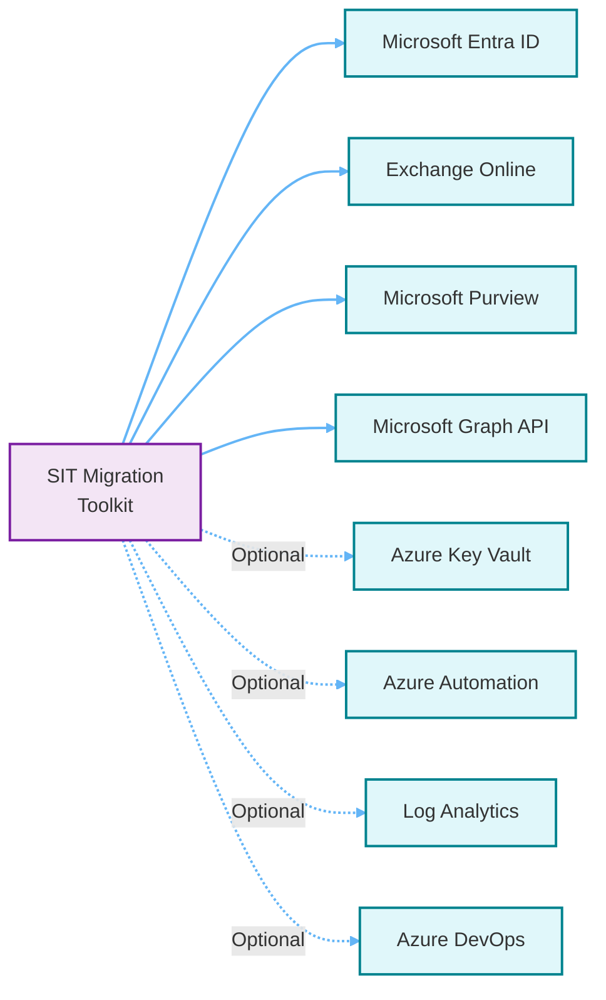

# 🏗️ Architecture Documentation

## Overview

This document provides architectural diagrams and visual representations of the Purview SIT Migration solution.

---

## 📊 Interactive Azure Diagrams

For interactive, animated diagrams with Azure icons, use **[Azure Diagrams](https://azurediagrams.com)**.

### How to Use Azure Diagrams

1. Visit [https://azurediagrams.com](https://azurediagrams.com)
2. Click "New Diagram" or "Examples"
3. Use the visual editor to create/modify the architecture
4. Export as PNG, SVG, or animated GIF
5. Share via URL

### Recommended Azure Icons for This Solution

| Component | Azure Icon | Notes |
|-----------|------------|-------|
| Source Tenant | Microsoft Entra ID | Identity provider |
| Target Tenant | Microsoft Entra ID | Identity provider |
| App Registration | App Registrations | Certificate-based auth |
| SIT Storage | Microsoft Purview | Compliance & DLP |
| Automation | Azure Automation | Optional for scheduling |
| Certificate Store | Azure Key Vault | Production cert storage |
| Logs | Log Analytics | Optional monitoring |

---

## 🔐 App Registration Flow Diagram

```mermaid
%%{init: {'theme':'base', 'themeVariables': { 'fontSize':'14px', 'lineColor':'#64b5f6', 'primaryColor':'#e3f2fd'}}}%%
graph TB
    %% Color Scheme with Visible Arrows
    classDef admin fill:#e8f5e9,stroke:#2e7d32,stroke-width:3px,color:#1b5e20,font-weight:bold;
    classDef script fill:#e3f2fd,stroke:#1565c0,stroke-width:2px,color:#0d47a1;
    classDef azure fill:#fff3e0,stroke:#ef6c00,stroke-width:3px,color:#e65100;
    classDef cert fill:#f3e5f5,stroke:#7b1fa2,stroke-width:2px,color:#4a148c;
    classDef config fill:#fff8e1,stroke:#ffa000,stroke-width:2px,color:#f57c00;
    classDef success fill:#c8e6c9,stroke:#388e3c,stroke-width:3px,color:#1b5e20;
    classDef security fill:#ffebee,stroke:#c62828,stroke-width:2px,color:#b71c1c;
    
    Admin([👤 Global Administrator]):::admin
    
    %% Phase 1: Preparation
    subgraph Phase1 [" 📋 Phase 1: Preparation "]
        direction TB
        P1_1[Install Microsoft.Graph Modules<br/>PowerShell SDK]:::script
        P1_2[Gather Tenant Info<br/>contoso.onmicrosoft.com]:::config
        P1_3[Verify Permissions<br/>Global Admin or App Admin]:::azure
        
        P1_1 --> P1_2 --> P1_3
    end
    
    %% Phase 2: Certificate Generation
    subgraph Phase2 [" 🔐 Phase 2: Certificate Generation "]
        direction TB
        P2_1[Run Setup Script<br/>00-Setup-AppRegistration.ps1]:::script
        P2_2[Generate Self-Signed Cert<br/>CSP Provider, 2048-bit RSA]:::cert
        P2_3[Export Private Key<br/>mycert.pfx + password]:::cert
        P2_4[Export Public Key<br/>mycert.cer]:::cert
        
        P2_1 --> P2_2 --> P2_3 --> P2_4
    end
    
    %% Phase 3: Azure AD Setup
    subgraph Phase3 [" 🏢 Phase 3: Microsoft Entra ID Configuration "]
        direction TB
        
        subgraph Browser [Browser Opens]
            P3_1[Connect to Microsoft Graph<br/>Admin Consent Required]:::azure
        end
        
        P3_2[Create App Registration<br/>Purview-SIT-Migration-App]:::azure
        P3_3[Upload Certificate<br/>Attach .cer to App]:::cert
        P3_4[Assign API Permissions<br/>Exchange.ManageAsApp]:::azure
        P3_5[Grant Admin Consent<br/>Organization-wide]:::azure
        P3_6[Assign Directory Role<br/>Compliance Administrator]:::azure
        
        P3_1 --> P3_2 --> P3_3 --> P3_4 --> P3_5 --> P3_6
    end
    
    %% Phase 4: Configuration
    subgraph Phase4 [" 💾 Phase 4: Configuration Export "]
        direction TB
        P4_1[Generate app-config.json<br/>App ID, Tenant ID, Thumbprint]:::config
        P4_2[Install Cert to Store<br/>Cert:\CurrentUser\My]:::cert
        P4_3[Set File Permissions<br/>Restrict .pfx access]:::security
        
        P4_1 --> P4_2 --> P4_3
    end
    
    %% Phase 5: Testing
    subgraph Phase5 [" 🧪 Phase 5: Connection Testing "]
        direction TB
        P5_1[Run Test Script<br/>00a-Test-AppConnection.ps1]:::script
        P5_2[Connect with Certificate<br/>Connect-IPPSSession]:::azure
        P5_3[Verify Permissions<br/>Get-DlpSensitiveInformationType]:::azure
        P5_4[Display Results<br/>Connection successful!]:::success
        
        P5_1 --> P5_2 --> P5_3 --> P5_4
    end
    
    %% Security Checks
    SecCheck1{🔒 Certificate<br/>Protected?}:::security
    SecCheck2{🔒 Config<br/>Protected?}:::security
    
    %% Final Output
    Ready[✅ Ready for Production<br/>App-Only Auth Enabled]:::success
    
    %% Flow
    Admin --> Phase1
    Phase1 --> Phase2
    Phase2 --> SecCheck1
    SecCheck1 -->|✓ .gitignore| Phase3
    SecCheck1 -.->|✗ Exposed| Stop1[❌ Review SECURITY.md]:::security
    Phase3 --> Phase4
    Phase4 --> SecCheck2
    SecCheck2 -->|✓ Protected| Phase5
    SecCheck2 -.->|✗ Exposed| Stop2[❌ Run Verify-Security.ps1]:::security
    Phase5 --> Ready
    
    %% Arrow styling for visibility on dark backgrounds
    linkStyle default stroke:#64b5f6,stroke-width:2px
```



---

## 🔄 Complete Migration Architecture

```mermaid
%%{init: {'theme':'base', 'themeVariables': { 'fontSize':'14px'}}}%%
graph TB
    %% Color Scheme
    classDef tenant fill:#e3f2fd,stroke:#1565c0,stroke-width:3px,color:#0d47a1;
    classDef app fill:#fff3e0,stroke:#ef6c00,stroke-width:2px,color:#e65100;
    classDef data fill:#f3e5f5,stroke:#7b1fa2,stroke-width:2px,color:#4a148c;
    classDef storage fill:#fff8e1,stroke:#ffa000,stroke-width:2px,color:#f57c00;
    classDef process fill:#e8f5e9,stroke:#2e7d32,stroke-width:2px,color:#1b5e20;
    classDef security fill:#ffebee,stroke:#c62828,stroke-width:2px,color:#b71c1c;
    
    %% Source Tenant
    subgraph Source [🏢 Source Tenant]
        direction TB
        SourceAD[Microsoft Entra ID<br/>contoso.onmicrosoft.com]:::tenant
        SourceApp[App Registration<br/>Source-SIT-App]:::app
        SourceSCC[Security & Compliance<br/>PowerShell]:::tenant
        SourceSITs[(Custom SITs<br/>Rule Packs)]:::data
        
        SourceAD --> SourceApp
        SourceApp --> SourceSCC
        SourceSCC --> SourceSITs
    end
    
    %% Automation/Workstation
    subgraph Automation [💻 Automation Environment]
        direction TB
        
        subgraph Certs [🔐 Certificate Store]
            SourceCert[Source Certificate<br/>Thumbprint: ABC123]:::security
            TargetCert[Target Certificate<br/>Thumbprint: DEF456]:::security
        end
        
        subgraph Scripts [📜 PowerShell Scripts]
            Connect[01-Connect-Tenant.ps1]:::process
            Export[03-Export-Custom-SITs.ps1]:::process
            Import[04-Import-Custom-SITs.ps1]:::process
        end
        
        subgraph Storage [💾 Local Storage]
            Config1[source-app-config.json]:::storage
            Config2[target-app-config.json]:::storage
            XmlFiles[(XML Exports<br/>Protected by .gitignore)]:::data
        end
        
        Certs --> Scripts
        Scripts --> Storage
    end
    
    %% Target Tenant
    subgraph Target [🏢 Target Tenant]
        direction TB
        TargetAD[Microsoft Entra ID<br/>fabrikam.onmicrosoft.com]:::tenant
        TargetApp[App Registration<br/>Target-SIT-App]:::app
        TargetSCC[Security & Compliance<br/>PowerShell]:::tenant
        TargetSITs[(Custom SITs<br/>Imported & Remapped)]:::data
        
        TargetAD --> TargetApp
        TargetApp --> TargetSCC
        TargetSCC --> TargetSITs
    end
    
    %% Optional Production Components
    subgraph Production [☁️ Optional: Production Enhancement]
        direction LR
        KeyVault[Azure Key Vault<br/>Secure Cert Storage]:::security
        AutoAccount[Azure Automation<br/>Scheduled Jobs]:::process
        LogAnalytics[Log Analytics<br/>Monitoring]:::storage
        
        KeyVault --> AutoAccount
        AutoAccount --> LogAnalytics
    end
    
    %% Flow
    Source -.->|1. Authenticate<br/>Certificate Auth| Automation
    Automation -->|2. Export<br/>Get-DlpSITRulePack| Source
    Source -->|3. XML Data| XmlFiles
    XmlFiles -->|4. GUID Remapping| Automation
    Automation -.->|5. Authenticate<br/>Certificate Auth| Target
    Automation -->|6. Import<br/>New-DlpSITRulePack| Target
    
    Production -.->|Secure Storage| Automation
    Automation -.->|Audit Logs| Production
    
    %% Arrow styling for visibility
    linkStyle default stroke:#64b5f6,stroke-width:2px
```



---

## 🔐 Security Architecture

```mermaid
%%{init: {'theme':'base', 'themeVariables': { 'fontSize':'14px'}}}%%
graph LR
    %% Color Scheme
    classDef secure fill:#c8e6c9,stroke:#388e3c,stroke-width:3px,color:#1b5e20;
    classDef caution fill:#fff9c4,stroke:#f57f17,stroke-width:2px,color:#f57f00;
    classDef danger fill:#ffcdd2,stroke:#c62828,stroke-width:3px,color:#b71c1c;
    
    subgraph Protected [✅ PROTECTED - Safe for Git]
        direction TB
        Code[PowerShell Scripts<br/>*.ps1]:::secure
        Docs[Documentation<br/>*.md]:::secure
        GitIgnore[.gitignore<br/>Protection Rules]:::secure
        
        Code ~~~ Docs ~~~ GitIgnore
    end
    
    subgraph Excluded [⚠️ EXCLUDED - In .gitignore]
        direction TB
        Certs[Certificates<br/>*.pfx, *.cer]:::caution
        Configs[Configurations<br/>app-config*.json]:::caution
        Exports[Exports<br/>*.xml files]:::caution
        Logs[Logs<br/>*.log files]:::caution
        
        Certs ~~~ Configs ~~~ Exports ~~~ Logs
    end
    
    subgraph Forbidden [🚫 NEVER COMMIT]
        direction TB
        PrivateKey[Private Keys<br/>Certificate passwords]:::danger
        Secrets[Secrets<br/>API keys, tokens]:::danger
        Creds[Credentials<br/>Usernames/passwords]:::danger
        
        PrivateKey ~~~ Secrets ~~~ Creds
    end
    
    subgraph Vault [☁️ PRODUCTION STORAGE]
        direction TB
        AKV[Azure Key Vault<br/>Certificates + Secrets]:::secure
        KMS[Key Management<br/>Rotation & Auditing]:::secure
        
        AKV --> KMS
    end
    
    GitIgnore -.->|Protects| Excluded
    GitIgnore -.->|Blocks| Forbidden
    Forbidden -.->|Store In| Vault
    Excluded -.->|Prod:| Vault
    
    %% Arrow styling for visibility
    linkStyle default stroke:#64b5f6,stroke-width:2px
```



---

## 📊 Data Flow: SIT Migration

```mermaid
%%{init: {'theme':'base', 'themeVariables': { 'fontSize':'14px'}}}%%
sequenceDiagram
    autonumber
    
    participant Admin as 👤 Administrator
    participant Script as 📜 PowerShell Script
    participant SourceAD as 🏢 Source Entra ID
    participant SourceSCC as 🔒 Source Compliance
    participant Local as 💾 Local Storage
    participant TargetAD as 🏢 Target Entra ID
    participant TargetSCC as 🔒 Target Compliance
    
    %% Source Export
    rect rgb(227, 242, 253)
        Note over Admin,SourceSCC: Phase 1: Export from Source
        Admin->>Script: Run 01-Connect-Tenant.ps1 -UseAppAuth
        Script->>SourceAD: Authenticate with Certificate
        SourceAD-->>Script: Access Token
        Script->>SourceSCC: Connect-IPPSSession
        SourceSCC-->>Script: Connected
        
        Admin->>Script: Run 03-Export-Custom-SITs.ps1
        Script->>SourceSCC: Get-DlpSensitiveInformationType
        SourceSCC-->>Script: Custom SIT List
        Script->>SourceSCC: Get-DlpSITRulePackage
        SourceSCC-->>Script: XML Rule Pack
        Script->>Local: Save XML file
        Script->>Local: Protected by .gitignore
    end
    
    %% Validation
    rect rgb(232, 245, 233)
        Note over Admin,Local: Security Check
        Admin->>Script: Run Verify-Security.ps1
        Script->>Local: Scan for sensitive files
        Local-->>Script: Files protected ✓
        Script-->>Admin: Safe to proceed
    end
    
    %% Target Import
    rect rgb(255, 248, 225)
        Note over Admin,TargetSCC: Phase 2: Import to Target
        Admin->>Script: Disconnect source, switch tenant
        Admin->>Script: Run 01-Connect-Tenant.ps1 -UseAppAuth -ConfigPath target
        Script->>TargetAD: Authenticate with Certificate
        TargetAD-->>Script: Access Token
        Script->>TargetSCC: Connect-IPPSSession
        TargetSCC-->>Script: Connected
        
        Admin->>Script: Run 04-Import-Custom-SITs.ps1
        Script->>Local: Read XML file
        Local-->>Script: XML content
        Script->>Script: Parse and remap GUIDs
        Script->>TargetSCC: New-DlpSITRulePackage
        TargetSCC-->>Script: Import successful
        
        Script->>TargetSCC: Verify imported SITs
        TargetSCC-->>Script: SIT list confirmed
        Script-->>Admin: Migration complete ✅
    end
```



---

## 🎯 Deployment Scenarios

### Scenario 1: Manual One-Time Migration
```
Developer Workstation
├── Install: PowerShell + ExchangeOnlineManagement
├── Run: 00-Setup-AppRegistration.ps1 (both tenants)
├── Manual: Export → Transfer → Import
└── Store: Certificates on workstation
```

### Scenario 2: Scheduled Automation
```
Azure Automation Account
├── Store: Certificates in Azure Key Vault
├── Schedule: Daily sync at 2 AM UTC
├── Script: Sample-Automated-Migration.ps1
├── Monitor: Log Analytics workspace
└── Alert: Email on failure
```

### Scenario 3: CI/CD Pipeline
```
Azure DevOps / GitHub Actions
├── Secret: Certificate stored in pipeline variables
├── Trigger: On commit to main branch
├── Task: Export → Validate → Import
├── Test: Verify SIT count matches
└── Report: Deployment summary
```

### Scenario 4: Multi-Tenant MSP
```
Managed Service Provider
├── Per-Customer: Separate app registrations
├── Storage: Azure Key Vault per customer
├── Automation: Centralized runbook
├── Billing: Track API calls per customer
└── Reporting: Customer portal dashboard
```

---

## 📈 Scalability & Performance

| Metric | Small | Medium | Large | Enterprise |
|--------|-------|--------|-------|------------|
| **Custom SITs** | < 10 | 10-50 | 50-200 | 200+ |
| **Export Time** | < 30s | 1-2 min | 3-5 min | 5-10 min |
| **File Size** | < 50 KB | 50-200 KB | 200 KB-1 MB | 1 MB+ |
| **Import Time** | < 1 min | 2-3 min | 5-8 min | 10-15 min |
| **Recommended** | Manual | Manual/Script | Automated | Automated+Monitoring |

---

## 🔗 Integration Points



---

## 📝 Azure Diagrams Template

To create an interactive diagram at [Azure Diagrams](https://azurediagrams.com):

1. **Add Azure Services:**
   - Microsoft Entra ID (Source & Target)
   - Azure Key Vault
   - Azure Automation (Optional)
   - Log Analytics (Optional)

2. **Add Custom Elements:**
   - PowerShell scripts (use compute icon)
   - Certificate storage (use key icon)
   - XML exports (use storage icon)

3. **Connect with Arrows:**
   - Authentication flows (dashed lines)
   - Data transfer (solid lines)
   - Optional components (dotted lines)

4. **Export Options:**
   - PNG for documentation
   - SVG for scaling
   - Animated GIF for presentations
   - Shareable URL

5. **Styling Tips:**
   - Use official Azure colors
   - Group related components
   - Add labels for clarity
   - Include version numbers

---

## 📚 References

- [Azure Icons Official](https://learn.microsoft.com/en-us/azure/architecture/icons/)
- [Mermaid Diagram Syntax](https://mermaid.js.org/)
- [Azure Architecture Center](https://learn.microsoft.com/en-us/azure/architecture/)

---

**Last Updated:** February 3, 2026  
**Diagram Version:** 1.0
