# Purview Compliance Toolkit

> **⚠️ DISCLAIMER — Scope & Supportability**
> This toolkit is a **community / field-authored project** and is **not a Microsoft-supported product**.
> It is designed exclusively for **single-tenant (tenant-local) backup, restore, and migration** of Purview compliance configurations.
> It does **not** provide Multi-Tenant Organization (MTO) labeling, DLP synchronization, or cross-tenant compliance management capabilities.
> MTO-aware labeling and DLP are **in-progress product features** owned by the Microsoft Purview engineering team.
> For MTO-specific requirements, please engage your Microsoft account team or the Purview product group directly — do not rely on this toolkit for MTO scenarios.

A comprehensive toolkit for **backup, restore, and migration** of Microsoft Purview compliance configurations between Microsoft 365 tenants.

## Supported Configuration Types

| Component | Export | Import | Script Pair |
|-----------|--------|--------|-------------|
| Custom Sensitive Information Types (SITs) | ✅ | ✅ | `03` / `04` |
| Sensitivity Labels & Policies | ✅ | ✅ | `05` / `06` |
| DLP Compliance Policies & Rules | ✅ | ✅ | `07` / `08` |
| Auto-Labeling Policies & Rules | ✅ | ✅ | `09` / `10` |
| Insider Risk Management | ⚠️ | ⚠️ | Not yet available (cmdlets not publicly documented) |

> **Orchestrators**: Use `Backup-PurviewConfig.ps1` and `Restore-PurviewConfig.ps1` for full configuration backup/restore in a single command.

> **CI/CD**: GitHub Actions and Azure DevOps pipeline definitions included for scheduled backups and automated migrations.

> 🔒 **SECURITY**: This repo is secured with comprehensive `.gitignore` rules. All certificates, configs, and export data are protected. **[Security Status →](REPOSITORY-SECURITY.md)** | **[Security Guidelines →](SECURITY.md)**

## 📋 Prerequisites

> 💡 **Visual Diagram**: For an interactive Azure architecture diagram of this solution, visit [Azure Diagrams](https://azurediagrams.com) and import the diagram definition from [ARCHITECTURE.md](ARCHITECTURE.md)

```mermaid
graph TD
    %% Professional Color Scheme
    classDef user fill:#e8f5e9,stroke:#2e7d32,stroke-width:2px,color:#1b5e20;
    classDef tech fill:#fff3e0,stroke:#ef6c00,stroke-width:2px,color:#e65100;
    classDef role fill:#e1f5fe,stroke:#0277bd,stroke-width:2px,color:#01579b;
    classDef auth fill:#fce4ec,stroke:#c2185b,stroke-width:2px,color:#880e4f;
    classDef azure fill:#e3f2fd,stroke:#1565c0,stroke-width:2px,color:#0d47a1;
    classDef group fill:#f9f9f9,stroke:#90a4ae,stroke-width:2px,stroke-dasharray: 5 5;

    Admin([👤 Global Admin]):::user
    
    subgraph Setup [Initial Setup Required]
        direction TB
        Module[📦 Install PowerShell Module<br/>ExchangeOnlineManagement]:::tech
        Policy[⚙️ Set ExecutionPolicy<br/>RemoteSigned]:::tech
        Module --> Policy
    end
    
    subgraph Auth_Choice [Choose Authentication Method]
        direction TB
        Interactive[🔐 Interactive Auth<br/>User Login + MFA]:::auth
        AppOnly[🤖 App-Only Auth<br/>Certificate-based]:::auth
        
        Interactive -.Quick Start.-> IntNote[✓ No setup needed<br/>✗ Manual each time]
        AppOnly -.Production.-> AppNote[✓ Fully automated<br/>✓ More secure<br/>ℹ️ Setup required]
    end
    
    subgraph Azure_Setup [App Registration Setup]
        direction LR
        EntraID[🏢 Microsoft Entra ID]:::azure
        AppReg[📝 Create App Registration]:::azure
        Cert[🔐 Generate Certificate]:::azure
        Perms[🔑 Assign Permissions<br/>Exchange.ManageAsApp]:::azure
        Role[👥 Assign Role<br/>Compliance Administrator]:::azure
        
        EntraID --> AppReg --> Cert --> Perms --> Role
    end
    
    subgraph Permissions [Required Roles in Both Tenants]
        direction TB
        Role1[✓ Compliance Administrator]:::role
        Role2[✓ Compliance Data Admin]:::role
        Role3[✓ Organization Management]:::role
        
        Role1 ~~~ Role2 ~~~ Role3
    end
    
    Admin --> Setup
    Setup --> Auth_Choice
    Auth_Choice --> |App-Only Selected| Azure_Setup
    Auth_Choice --> |Interactive Selected| Permissions
    Azure_Setup --> Permissions
    
    class Setup,Auth_Choice,Azure_Setup,Permissions group
    
    %% Arrow styling for visibility
    linkStyle default stroke:#64b5f6,stroke-width:2px
```



### 1. PowerShell Modules
Ensure you have the Exchange Online Management module installed (required for Security & Compliance PowerShell).
Run this in an Administrator PowerShell window:

```powershell
Install-Module -Name ExchangeOnlineManagement -Force
```

### 2. Authentication Method

#### Option A: Interactive User Authentication (Default)
- ✅ Easy to setup (no prerequisites)
- ✅ Works immediately
- ❌ Requires manual login each time
- ❌ Not suitable for automation

#### Option B: App-Only Authentication (Recommended for Automation)
- ✅ Fully automated (no user interaction)
- ✅ Certificate-based (more secure)
- ✅ Perfect for CI/CD and scheduled tasks
- ℹ️ Requires initial setup

> ⚠️ **IMPORTANT**: You need **TWO separate app registrations** - one in the **source tenant** and one in the **target tenant**. Each tenant requires its own app, certificate, and configuration.

**Setup for source tenant:**

```powershell
.\00-Setup-AppRegistration.ps1 -Organization "contoso.onmicrosoft.com"
# Creates: mycert.pfx, app-config.json
# Rename to: mycert-source.pfx, source-app-config.json
```

**Setup for target tenant:**

```powershell
.\00-Setup-AppRegistration.ps1 -Organization "fabrikam.onmicrosoft.com"
# Creates: mycert.pfx, app-config.json
# Rename to: mycert-target.pfx, target-app-config.json
```

📖 **[Complete App Registration Guide](APP-REGISTRATION-GUIDE.md)** - Detailed setup instructions

### 3. Permissions
The user/app running these scripts must have one of the following roles in the **Source** and **Target** tenants:
*   **Compliance Administrator** (Recommended)
*   **Compliance Data Administrator**
*   **Organization Management**

### 4. Execution Policy
You may need to allow script execution:
```powershell
Set-ExecutionPolicy -ExecutionPolicy RemoteSigned -Scope CurrentUser
```

---

## 🚀 Migration Workflow

> 💡 **Tip**: You can visualize this entire flow with Azure icons using [Azure Diagrams](https://azurediagrams.com) - see [ARCHITECTURE.md](ARCHITECTURE.md) for the architecture definition

```mermaid
%%{init: {'theme':'base', 'themeVariables': { 'fontSize':'16px', 'lineColor':'#64b5f6', 'primaryColor':'#e3f2fd', 'primaryTextColor':'#0d47a1'}}}%%
graph TB
    %% Enhanced Professional Color Scheme with Visible Arrows
    classDef step fill:#e3f2fd,stroke:#1565c0,stroke-width:3px,color:#0d47a1,font-weight:bold;
    classDef script fill:#f3e5f5,stroke:#7b1fa2,stroke-width:2px,color:#4a148c;
    classDef artifact fill:#fff8e1,stroke:#ffa000,stroke-width:3px,color:#e65100;
    classDef tenant fill:#e8f5e9,stroke:#2e7d32,stroke-width:3px,color:#1b5e20;
    classDef container fill:#fafafa,stroke:#bdbdbd,stroke-width:2px;
    classDef security fill:#ffebee,stroke:#c62828,stroke-width:2px,color:#b71c1c;
    
    Start([🚀 Start Migration]):::step
    
    %% Source Tenant Phase
    subgraph SourceTenant [📍 Source Tenant - contoso.onmicrosoft.com]
        direction TB
        
        subgraph Auth1 [🔐 Authentication]
            direction LR
            Auth1A[Interactive Login<br/>OR]:::script
            Auth1B[Certificate Auth<br/>./01-Connect-Tenant.ps1]:::script
            Auth1A ~~~ Auth1B
        end
        
        Connect1[✓ Connected to<br/>Security & Compliance]:::step
        
        Export[📤 Export Custom SITs<br/>./03-Export-Custom-SITs.ps1]:::script
        
        Validate1[✓ Validate Export<br/>Parse XML & Count SITs]:::step
        
        Auth1 --> Connect1 --> Export --> Validate1
    end
    
    %% Transfer Phase
    XmlFiles[📦 XML Files<br/>source-export-GUID.xml]:::artifact
    
    Security{🔒 Security Check<br/>Files Protected?}:::security
    
    %% Target Tenant Phase
    subgraph TargetTenant [📍 Target Tenant - fabrikam.onmicrosoft.com]
        direction TB
        
        subgraph Auth2 [🔐 Authentication]
            direction LR
            Auth2A[Interactive Login<br/>OR]:::script
            Auth2B[Certificate Auth<br/>./01-Connect-Tenant.ps1]:::script
            Auth2A ~~~ Auth2B
        end
        
        Connect2[✓ Connected to<br/>Security & Compliance]:::step
        
        Import[📥 Import Custom SITs<br/>./04-Import-Custom-SITs.ps1]:::script
        
        Transform[⚙️ Transform<br/>Remap GUIDs]:::step
        
        Validate2[✓ Validate Import<br/>Verify All SITs Created]:::step
        
        Auth2 --> Connect2 --> Import --> Transform --> Validate2
    end
    
    Complete([✅ Migration Complete]):::step
    
    %% Flow
    Start --> SourceTenant
    SourceTenant --> XmlFiles
    XmlFiles --> Security
    Security -->|✓ Protected by .gitignore| TargetTenant
    Security -.->|✗ Exposed!| Stop[❌ STOP<br/>Review SECURITY.md]:::security
    TargetTenant --> Complete
    
    class SourceTenant,TargetTenant container
    
    %% Arrow styling for visibility
    linkStyle default stroke:#64b5f6,stroke-width:2px
```



### Step 1: Connect to Source Tenant
Run the connection script and sign in with your **Source** tenant credentials.
```powershell
.\01-Connect-Tenant.ps1
```

### Step 2: Export Custom SITs
Export all custom SIT rule packs from the source tenant.
```powershell
.\03-Export-Custom-SITs.ps1
```
*   Output: XML files will be saved in the `exports/` folder.
*   Note: Identify the specific XML file you want to import.

### Step 3: Connect to Target Tenant
**Open a NEW PowerShell window** to ensure a clean session, or re-run the connection script and sign in with **Target** tenant credentials.
```powershell
.\01-Connect-Tenant.ps1
```

### Step 4: Import SITs
Import the exported XML file into the target tenant.
```powershell
.\04-Import-Custom-SITs.ps1 -SourceXmlPath ".\exports\source-export-GUID.xml"
```
*   This script handles the GUID mapping and creation automatically.

---

## 📦 Full Backup & Restore

### One-Command Backup
Export all compliance configuration from the connected tenant:
```powershell
.\01-Connect-Tenant.ps1
.\Backup-PurviewConfig.ps1
```
*   Output: Timestamped backup folder in `exports/backup-<timestamp>/`
*   Includes: SIT rule packs, sensitivity labels, DLP policies, auto-labeling policies
*   Creates a `backup-manifest.json` linking all exported files

### One-Command Restore
Restore a full backup to the target tenant:
```powershell
.\01-Connect-Tenant.ps1 -TenantType Target
.\Restore-PurviewConfig.ps1 -BackupPath ".\exports\backup-20260226-120000"
```

### Selective Backup/Restore
Skip specific components with flags:
```powershell
# Backup only labels and DLP
.\Backup-PurviewConfig.ps1 -SkipSITs -SkipAutoLabel

# Restore DLP in test mode, skip existing items
.\Restore-PurviewConfig.ps1 -BackupPath ".\exports\backup-20260226-120000" -TestMode -SkipExisting
```

---

## 🏷️ Individual Component Scripts

### Sensitivity Labels (05/06)
```powershell
# Export labels and label policies
.\05-Export-SensitivityLabels.ps1

# Import to target tenant
.\06-Import-SensitivityLabels.ps1 -LabelsFile ".\exports\labels-export-*.json" -PoliciesFile ".\exports\label-policies-export-*.json"
```

### DLP Policies (07/08)
```powershell
# Export DLP policies and rules
.\07-Export-DlpPolicies.ps1

# Import to target (test mode recommended first)
.\08-Import-DlpPolicies.ps1 -PoliciesFile ".\exports\dlp-policies-export-*.json" -RulesFile ".\exports\dlp-rules-export-*.json" -TestMode
```

### Auto-Labeling Policies (09/10)
```powershell
# Export auto-labeling policies and rules
.\09-Export-AutoLabelPolicies.ps1

# Import to target
.\10-Import-AutoLabelPolicies.ps1 -PoliciesFile ".\exports\auto-label-policies-export-*.json" -RulesFile ".\exports\auto-label-rules-export-*.json"
```

---

## 🔄 CI/CD Pipelines

### GitHub Actions
- **`.github/workflows/purview-backup.yml`** — Scheduled weekly backup (Sunday 02:00 UTC) with manual trigger
- **`.github/workflows/purview-migration.yml`** — On-demand source→target migration with component selection

### Azure DevOps
- **`.azure-pipelines/purview-backup.yml`** — Scheduled backup with artifact publishing
- **`.azure-pipelines/purview-migration.yml`** — Two-stage migration (Export → Import) with environment approval

**Required Secrets/Variables:** See pipeline YAML headers for the list of secrets needed (tenant IDs, client IDs, base64-encoded certificates).

---

## 🧪 Testing & Validation

### End-to-End Migration Loop
To verify the migration process without needing a second tenant, use the Loop Test script. 
This script will:
1. (Optional) Create sample SITs.
2. Export them.
3. **Delete** them from the tenant.
4. Import them back from the XML.
5. Verify restoration.

```powershell
.\99-Test-Migration-Loop.ps1
```
*   **Warning**: This script deletes data. Only use with "Demo" rule packs.

---

## 🛠️ Helper Scripts

### Setup & Configuration
*   **`00-Setup-AppRegistration.ps1`**: Creates Azure AD app registration with certificate-based authentication for unattended automation. See [App Registration Guide](APP-REGISTRATION-GUIDE.md).
*   **`00a-Test-AppConnection.ps1`**: Tests the app-only authentication connection.
*   **`00-Verify-Connection.ps1`**: Verifies connection and lists existing custom SITs.

### Orchestrators
*   **`Backup-PurviewConfig.ps1`**: Full backup orchestrator — runs all export scripts and writes a backup manifest.
*   **`Restore-PurviewConfig.ps1`**: Full restore orchestrator — reads backup manifest and runs all import scripts in dependency order.

### Testing & Development
*   **`02-Create-Sample-SITs.ps1`**: (Optional) Creates dummy data for testing purposes. Not required for actual migration.

### ⚠️ Known Limitations
*   **Insider Risk Management** — `Get-InsiderRiskPolicy` and related cmdlets are not publicly documented in the Security & Compliance PowerShell module. Manual portal-based backup or future Microsoft API support required.
*   **Label encryption settings** — Re-creating labels with Azure RMS encryption requires the target tenant to have the same Azure RMS configuration. Encryption settings are exported for reference but may need manual configuration.
*   **Label/policy propagation** — Sensitivity labels and their policies may take up to 24 hours to propagate to all users and services after import.

### 🚫 Multi-Tenant Organization (MTO) — Out of Scope

This toolkit operates on a **single tenant at a time**. It does **not** address:

*   **MTO-aware sensitivity labeling** — Consistent label definitions, visual markings, or encryption behaviors across tenants in a Multi-Tenant Organization.
*   **Cross-tenant DLP policy synchronization** — Automatic mirroring or federation of DLP policies and rules across MTO member tenants.
*   **Cross-tenant label scoping or priority resolution** — Handling conflicts when labels from different tenants apply to the same content.

**Why?** These capabilities require deep platform-level integration (e.g., cross-tenant trust, unified policy evaluation, shared label metadata) that cannot be replicated through PowerShell scripting or configuration export/import. They are **active areas of investment by the Microsoft Purview product team**.

**What to do if you have MTO requirements:**
1. Engage your **Microsoft Account Team** or **Customer Success Account Manager (CSAM)** to discuss your MTO compliance needs.
2. File feature requests through the **[Microsoft Purview feedback portal](https://feedbackportal.microsoft.com/)** or **Microsoft 365 Admin Center > Support**.
3. Review the **[Microsoft 365 Roadmap](https://www.microsoft.com/en-us/microsoft-365/roadmap)** for upcoming MTO-related Purview capabilities.
4. Do **not** attempt to use this toolkit as a substitute for native MTO product features — it will not produce consistent cross-tenant behavior.

---

## 📚 Additional Documentation

- **[ARCHITECTURE.md](ARCHITECTURE.md)** - 🏗️ Architecture diagrams and visual flows (includes app registration flow)
- **[SECURITY.md](SECURITY.md)** - 🔒 **READ THIS FIRST** - Security guidelines and what NOT to commit
- **[REPOSITORY-SECURITY.md](REPOSITORY-SECURITY.md)** - Quick security status and checklist
- **[App Registration Guide](APP-REGISTRATION-GUIDE.md)** - Complete guide for setting up certificate-based authentication
- **[Quick Start Guide](QUICK-START.md)** - Command reference and common scenarios
- **[Microsoft Learn: App-only authentication](https://learn.microsoft.com/en-us/powershell/exchange/app-only-auth-powershell-v2?view=exchange-ps)** - Official Microsoft documentation

### 🎨 Visual Diagrams

Want animated diagrams with Azure icons? 
- See **[ARCHITECTURE.md](ARCHITECTURE.md)** for mermaid diagrams and Azure Diagrams templates
- Visit **[Azure Diagrams](https://azurediagrams.com)** to create interactive versions
- Export as PNG, SVG, or animated GIF for presentations

---

## ⚠️ Important Security Notes

Before using this toolkit or committing to source control:

1. **🚫 NEVER commit these files:**
   - `*.pfx`, `*.p12` - Certificate private keys
   - `*.cer` - Certificate public keys
   - `app-config*.json` - Configuration files with App IDs
   - `exports/*.xml` - Export files with custom SIT patterns
   - Any files containing credentials or secrets

2. **✅ Protected by `.gitignore`:**
   - All certificate files are automatically excluded
   - Configuration files are ignored
   - Export data is not tracked
   - Logs and temporary files are excluded

3. **📖 Read the security guide:**
   - See [SECURITY.md](SECURITY.md) for complete security guidelines
   - Learn how to store certificates securely
   - Understand what to do if secrets are accidentally committed

---
